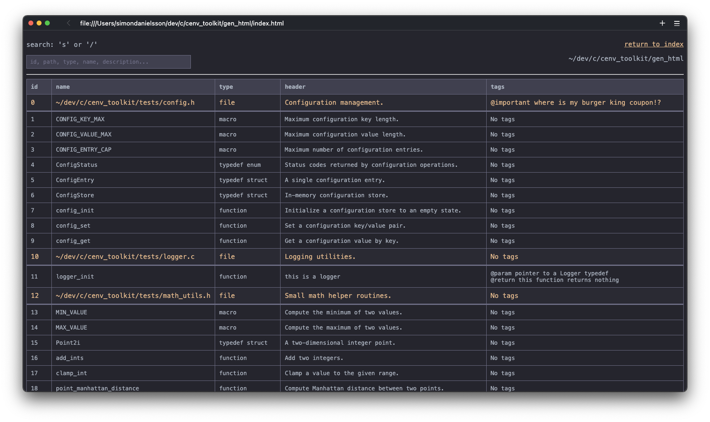
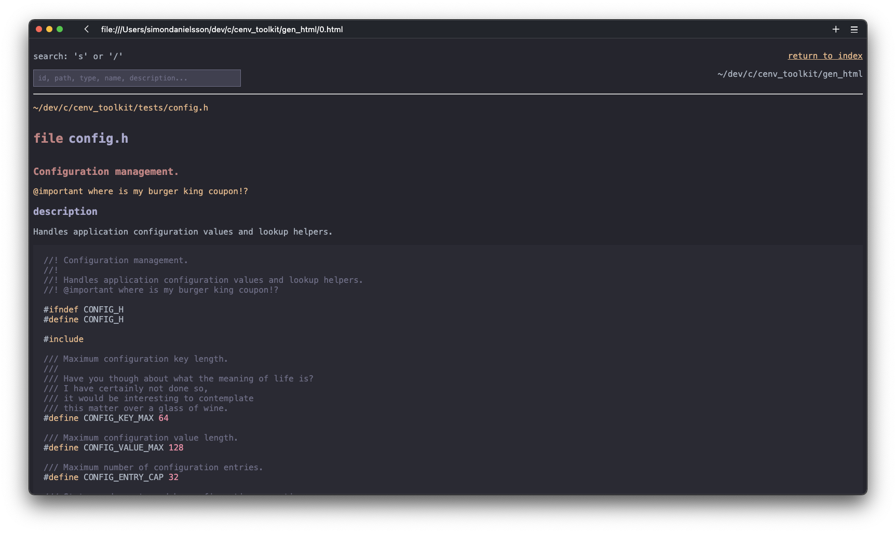

<p align="center">
    
</p>

<p align="center">
  <em>C without ceremony.</em>
</p>
  
<p align="center">
    
  
</p>
  
<p align="center">
  <a href="#info">Info</a> •
  <a href="#install">Install</a> •
  <a href="#usage">Usage</a> •
  <a href="#toolkit">Toolkit</a> •
  <a href="#license">License</a>
</p>  
  
---
<div id="info"></div>

## Info
  
cenv assumes that **everything required to build and maintain a C project should live within the codebase itself**. It is an *opinionated* development environment built for developing small to medium sized C projects.
  
Prerequisites:  
- git  
- curl  
- a C compiler  
  
> [!IMPORTANT]  
> 1. No support for Windows.
> 2. Since cenv is heavily opinionated and built for my own specific workflow, I can't
> guarantee that this will function properly on your computer (or be enjoyable
> to use.)
  
cenv relies on [nob.h](https://github.com/tsoding/nob.h) (a header-only
build-system) for compilation.  
  


---
<div id="install"></div>

## Install
  
[cenv-init.sh](./cenv-init.sh) is what you will be using to build new cenv projects - add it as an alias in your `.bashrc`:  
  
``` bash
# ~/.bashrc

# cinit script
alias cinit="$HOME/path/to/cenv-init.sh"

# this function lets you launch cenv from anywhere
# within your cenv project folder (assuming you have
# a .gitignore in its root)
cenv() {
    local dir="$(pwd)"
    while [[ "$dir" != "/" ]]; do
        if [[ -f "$dir/.gitignore" ]]; then
            (cd "$dir" && ./cenv "$@")
            return
        fi
        dir="$(dirname "$dir")"
    done
    return 1
}
```
  
---
<div id="usage"></div>
  
## Usage
  
Run cinit in your destination folder with the project name as an argument, then run the help command to get started:  
  
``` bash
cinit my_project
cd my_project
cenv help
```
 
When you run `cenv help` you will see the following commands:

``` terminal
cenv debug
│ compile into and run from './build/debug' with debug options
╰ default command
cenv release
╰ compile into and run from './build/release' with optimizations
cenv test
│ compile into and run from './build/tests' directory with debug options
╰ the source folder used for this command is './tests'

cenv doc
│ auto-generate docs from './src' and open in browser
╰ this command is still in the experimental stage
cenv todo
╰ find and print all 'TODO' statements in codebase
cenv update
│ update bundled cenv tools and header-only libraries from their
╰ known upstream git sources - user-added dependencies are safely ignored
cenv help
╰ display help

cenv restore
╰ (git) HARD reset to latest commit
cenv tag <version>
│ (git) create new annotated tag
╰ ex.: run tag v1.2.1
```
  
---
<div id="toolkit"></div>
  
## Toolkit
    
[cenv toolkit source code](https://github.com/simon-danielsson/cenv_toolkit)

### cenv todo
  
'cenv todo' returns a formatted list of all 'TODO' statements found, each with a reference to file and line number. In addition to this, 'cenv todo' collects entire 'TODO' paragraphs, not just lines.
  
### cenv doc
  
cenv comes bundled with its own auto-documentation tool that generates a static html page you can browse, similar to the 'cargo doc' system from Rust. The syntax is simple to understand and is explained within the following example code.
  
``` c
//! Math utilities
//!
//! Simple utilities for calculating numbers.
//! 
//! A good practice is to give every file in your project a header
//! like this one. 
//! <--- "//!" is the syntax used for file headers.
//! 
//! @important This is the file header comment.

// There are three tags you can use to spice up your documentation apart from
// headers and comments: @important, @param and @return. 
// 
// These tags are not bound to any specific rule or syntax, so you can 
// place whatever text you want after them - you can use as many tags as you 
// want in a single piece of documentation, with the caveat that they can not
// be multi-line.
// The cenv parser doesn't care where the tags are so you can place a...
// @important hello
// ...tag anywhere and it will work the same as placing tags at the end or
// grouping tags together.

// cenv is not using the standard "//" or "/**/" comments as doc comments 
// so that you, as the programmer, can be explicit about which comments you
// want to use as documentation and which should be used internally only


/// Used for setting factor in submult() function
#define MULT 5 // only adding a header is fine too

/// sum two integers
///
/// @param y int
/// @param x int
/// @return sum
int add(int y, int x) {
    return y + x;
}

/// y - x * MULT
/// The header is always whatever line is at the top,
/// while the description always comes afterwards.
/// Note that the header can only be a single line.
/// <-- "///" is comment syntax used for functions
/// @param two integers
/// @important this is only used once
/// @return sum
int submult(int y, int x) {
    return (y - x) * MULT;
}
```
### example generated cenv documentation pages
  


  
---
<div id="license"></div>

## License
  
This project is licensed under the [MIT License](https://github.com/simon-danielsson/cenv/blob/main/LICENSE).  
 
